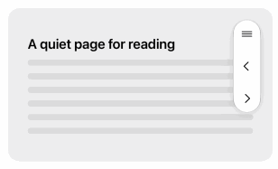
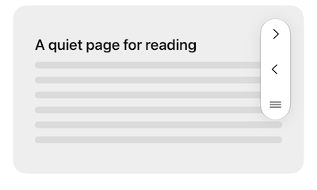
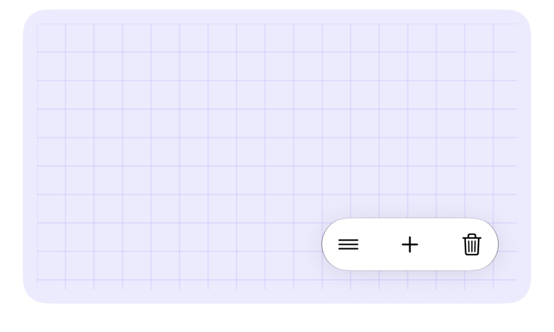

# ControlBar

[](https://www.swift.org)
[](https://developer.apple.com/ios/)
[](https://developer.apple.com/macos/)
[](https://developer.apple.com/visionos/)

A SwiftUI view for grouping a set of controls or other small views together near the edge of its container. ControlBar lays out related items horizontally or vertically, keeps them clear of safe areas, and lets people drag the group between supported edge positions.

It supports iOS and macOS, and automatically positions its content within the safe area on iOS. On devices with screen-corner occlusion regions, such as iPhone Duo, it instead uses the edge-to-edge area and shifts the bar clear of the occluded corner.



## Requirements

- Swift 6.3 or later
- iOS 26, macOS 26, or visionOS 26

## Installation

Add ControlBar to your package dependencies:

```swift
dependencies: [
    .package(
        url: "https://github.com/jnutting/ControlBar.git",
        branch: "main"
    )
]
```

Then add `ControlBar` to the target that uses it:

```swift
.target(
    name: "MyApp",
    dependencies: ["ControlBar"]
)
```

In Xcode, choose **File → Add Package Dependencies…** and enter:

```
https://github.com/jnutting/ControlBar.git
```

## Quick start

Place a `ControlBar` in a `ZStack` with the content it controls. Give every `ControlBarItem` a stable identifier; mark buttons and other interactive controls with `isInteractive: true`.  Any space within the ControlBar that does not contain interactive items will function as a drag surface; if your items are all interactive, there will be no drag surface available, so it's best to include a non-interactive item, such as the drag-handle image below, as a dedicated drag surface.

```swift
import SwiftUI
import ControlBar

struct ReaderView: View {
    var body: some View {
        ZStack {
            DocumentView()

            ControlBar(
                items: [
                    ControlBarItem(id: "dragHandle", isInteractive: false) {
                        Image(systemName: "line.3.horizontal")
                    },
                    ControlBarItem(id: "previous", isInteractive: true) {
                        Button("Previous", systemImage: "chevron.left") {
                            // Show the previous page.
                        }
                    },
                    ControlBarItem(id: "next", isInteractive: true) {
                        Button("Next", systemImage: "chevron.right") {
                            // Show the next page.
                        }
                    }
                ],
                position: .trailingEdgeTop
            )
            .buttonStyle(.borderedProminent)
        }
    }
}
```



Unless otherwise specified, the bar starts at the leading end of the top edge. It can be dragged to another supported edge, and its layout changes orientation automatically with a smooth Liquid Glass animation. Upon release, the bar will animate to the nearest available position, of which there are eight: one horizontal and one vertical at each corner.

## Persist the position

Supply a binding when the surrounding view owns the position. This makes it easy to preserve a user's preferred location.

```swift
struct CanvasView: View {
    @State private var controlBarPosition: ControlBar.Position = .bottomEdgeTrailing

    var body: some View {
        ZStack {
            Canvas { _, _ in }

            ControlBar(
                items: [
                    ControlBarItem(id: "dragHandle", isInteractive: false) {
                        Image(systemName: "line.3.horizontal")
                    },
                    ControlBarItem(id: "add", isInteractive: true) {
                        Button("Add", systemImage: "plus") {
                            // Add content.
                        }
                    },
                    ControlBarItem(id: "delete", isInteractive: true) {
                        Button("Delete", systemImage: "trash") {
                            // Delete the selected content.
                        }
                    }
                ],
                position: $controlBarPosition,
                minimumEdgeInsets: EdgeInsets(
                    top: 24,
                    leading: 24,
                    bottom: 24,
                    trailing: 24
                )
            )
            .buttonStyle(.borderedProminent)
            .tint(.indigo)
        }
    }
}
```



## Additional configuration options

If you want to the order of items to be reversed in some positions, provide an `itemOrder:` closure and use the provided `position` to decide whether it should be `.normal` or `.reversed`.

If you want the bar to be fixed in its starting position, use `draggable: false`.

It's easy to provide a different list of items at different moments, by maintaining your own array of `ControlBar.Item` instances that you pass to ControlBar in your view body; in this way you can conditionally remove items that don't belong at certain times. As long as each item has a unique, stable identifier throughout its usage, ControlBar will animate smoothly between different arrays of controls that you provide.

## License

ControlBar is available under the license in the repository.
